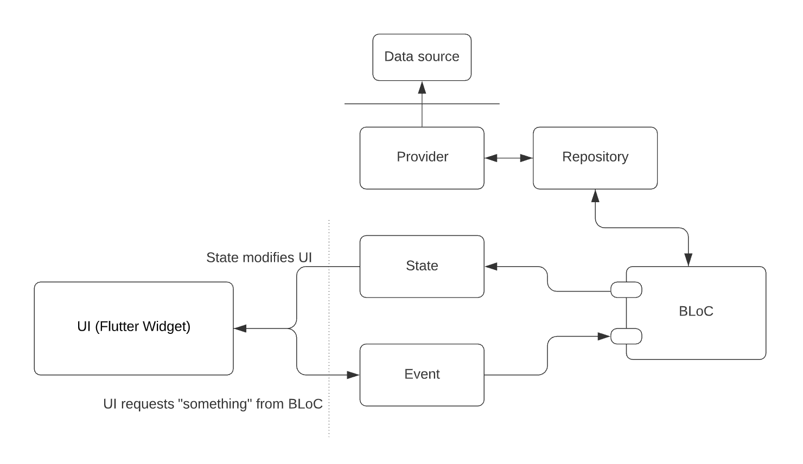

# c2sanilist

Anime browser built with AniList APIs. The purpose of this project is to showcase clean Flutter application architecture with BLoC design pattern.

## Usage

Install dependencies with `flutter pub get`. This repository assumes you have latest **stable** version of Flutter installed (2.X). It provides support for web and [desktop](https://flutter.dev/desktop).

You can run the app with `flutter run`.

## Architecture



Application architecture strictly follows SOLID principles; which is the separation of presentation from business logic. In general, given a **data source** (API, local/remote database), we first define a **provider**. Providers allow for raw access to resources, returning raw data (in form of maps or other primitive data types).

Providers are wrapped with one or more **repositories**. Being a wrapper, their job is to interpret the raw data coming from providers, performing validation and encapsulation of data into **models**. Models are immutable classes.

Repositories are injected into a **BLoC container**. Each BloC container has a corresponding **state** and **event**. States and events are actualized as either enumerated types or abstract classes. Therefore, individual state/event items are either enumerated type items or subclasses.

### Provider

In this case, we're talking about a simple GraphQL API, therefore the provider itself is relatively simple to understand. It contains a single top-level function.

```dart
import 'dart:convert';

import 'package:c2sanilist/utils/exceptions/api.exception.dart';
import 'package:c2sanilist/utils/helpers/format_query.helper.dart';
import 'package:http/http.dart';

final Uri _baseUri = Uri.parse('https://graphql.anilist.co');

Future<String> makeGraphQLRequest(
  String query, {
  Map<String, dynamic>? variables,
}) async {
  final request = await post(
    _baseUri,
    headers: {'Content-Type': 'application/json'},
    body: json.encode(
      {
        'query': formatQuery(query),
        'variables': variables ?? {},
      },
    ),
  );

  if (request.statusCode != 200) {
    throw ApiException(request.statusCode, request.body);
  }
  return request.body;
}
```

As you can see, the return type of a provider is a raw string, which is later (in repository) decoded.

### Repositories

Let's begin by examining the `summary.repository.dart` source.

```dart
abstract class _ISummaryRepository {
  Future<List<SummaryModel>> fetchSummary(int page, int perPage);
}

class SummaryRepository implements _ISummaryRepository {
  static final SummaryRepository _instance = SummaryRepository._();

  SummaryRepository._();
  factory SummaryRepository.instance() => _instance;

  @override
  Future<List<SummaryModel>> fetchSummary(int page, int perPage) async {
    return compute<Pair<String, Map<String, dynamic>>, List<SummaryModel>>(
      _parseFetchSummary,
      Pair(FETCH_HOMEPAGE, {'page': page, 'perPage': perPage}),
    );
  }
}

Future<List<SummaryModel>> _parseFetchSummary(
  Pair<String, Map<String, dynamic>> data,
) async {
  try {
    final rawRequest = await makeGraphQLRequest(
      data.first,
      variables: data.second,
    );

    final request = json.decode(rawRequest) as Map<String, dynamic>;
    final summaries = (request['data']['Page']['media'] as List<dynamic>)
        .cast<Map<String, dynamic>>()
        .where((element) =>
            element['coverImage']['large'] != null &&
            element['description'] != null)
        .map((element) => SummaryModel.fromJson(element))
        .toList();
    return summaries;
  } on ApiException catch (e) {
    print(e.toString());
    return <SummaryModel>[];
  }
}
```

Right off the bat, two observations:

1. Private abstract class with definitions of methods the repository class needs to implement
2. Use of `compute` to offload majority of work on a separate isolate.

Repositories wrap the providers and encapsulate data into models. For instance, `SummaryModel` looks like this:

```dart
@immutable
class SummaryModel extends Equatable {
  final int id;
  final String title;
  final String description;
  final String mediaURL;

  SummaryModel._({
    required this.id,
    required this.title,
    required this.description,
    required this.mediaURL,
  });

  factory SummaryModel.fromJson(Map<String, dynamic> json) {
    return SummaryModel._(
      id: json['id'],
      title: json['title']['english'] ?? json['title']['romaji'],
      description: ((json['description'] as String).split(' ')).length < 20
          ? json['description']
          : (json['description'] as String)
                  .split(' ')
                  .sublist(0, 20)
                  .join(' ')
                  .replaceAll(r'<[^>]*>', '') +
              '...',
      mediaURL: json['coverImage']['large'],
    );
  }

  @override
  List<Object?> get props => [
        id,
        title,
        description,
        mediaURL,
      ];
}
```

We use a combination of `meta` and `equatable` packages here. With `meta`, we get a set of useful annotations that help express intentions otherwise impossible to be deduced by static code analysis. With `equatable` we handle successful overwrites of `hashCode` and equals (`==`) operators.

### BLoC

Unfortunately, we cannot achieve much constraint on inheritance in Dart (lack of sealed classes), so we use factory constructor pattern when accessing subclasses. When it comes to injection of repositories (or providers into repositories, for the matter of fact), we do not have a solid dependency injection solution in Dart. Although they exist, they are not viable and represent too much overhead. We can “cheat” by instantiating repositories inside BLoC provider declarations in main file, and as for repositories, provider is just a single top-level method, so not much is lost here.

So, examples of state and events:

```dart
import 'package:equatable/equatable.dart';
import 'package:meta/meta.dart';

/*
=======================================================
======================= EVENTS ========================
=======================================================
*/

@sealed
abstract class DetailsEvent extends Equatable {
  const DetailsEvent._();

  @protected
  factory DetailsEvent.retrieve(int mediaID) = RetrieveDetailsEvent;
}

class RetrieveDetailsEvent extends DetailsEvent {
  final int mediaID;

  const RetrieveDetailsEvent(this.mediaID) : super._();

  @override
  List<Object?> get props => [mediaID];
}

/*
=======================================================
======================= STATES ========================
=======================================================
*/
@sealed
abstract class DetailsState extends Equatable {
  const DetailsState._();

  @protected
  factory DetailsState.loading() = LoadingDetailsState;

  @protected
  factory DetailsState.successful(
    DetailsModel data,
  ) = SuccessfulDetailsState;

  @protected
  factory DetailsState.failed(
    String error,
  ) = FailedDetailsState;
}

class LoadingDetailsState extends DetailsState {
  const LoadingDetailsState() : super._();

  @override
  List<Object?> get props => [];
}

class SuccessfulDetailsState extends DetailsState {
  final DetailsModel data;

  const SuccessfulDetailsState(this.data) : super._();

  @override
  List<Object?> get props => [data];
}

class FailedDetailsState extends DetailsState {
  final String error;

  const FailedDetailsState(this.error) : super._();

  @override
  List<Object?> get props => [error];
}
```

and lastly, the BLoC container itself.

```dart
class DetailsBloc extends Bloc<DetailsEvent, DetailsState> {
  @internal
  final DetailsRepository repository;

  DetailsBloc({
    required this.repository,
  }) : super(DetailsState.loading());

  @override
  Stream<DetailsState> mapEventToState(DetailsEvent event) async* {
    if (event is RetrieveDetailsEvent) {
      yield DetailsState.loading();
      final data = await repository.fetchMedia(event.mediaID);
      if (data != null) {
        yield DetailsState.successful(data);
      } else {
        yield DetailsState.failed('Could not retrieve media details');
      }
    } else {
      yield DetailsState.failed('Unknown error');
    }
  }
}
```

# License

Project is open-sourced under [MIT license](LICENSE).